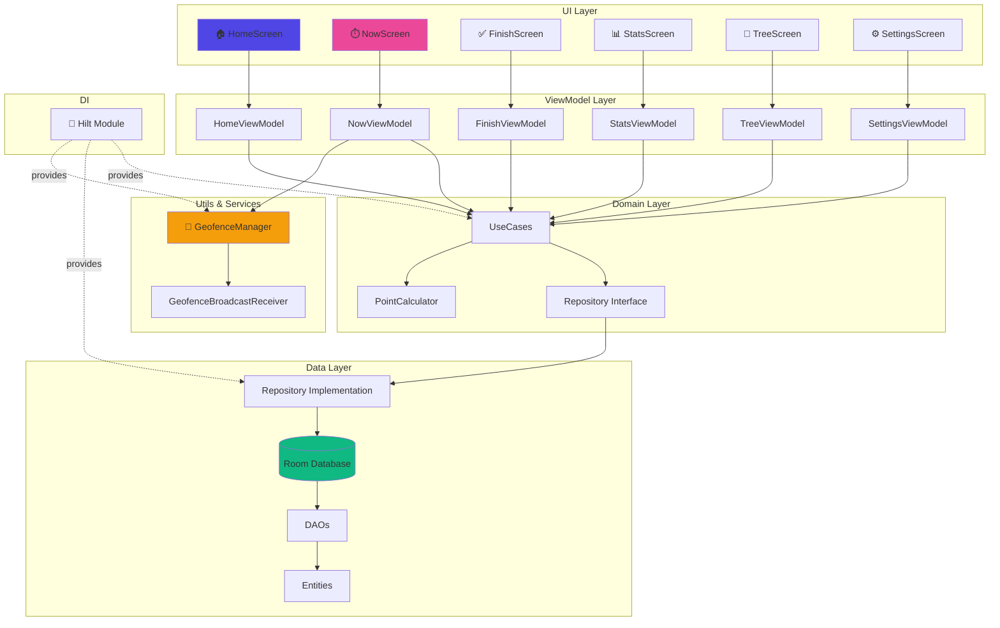

# University app (Daigakuapp) - インストールガイド

このプロジェクトは、**Jetpack Compose**と**Room Database**で構築されたネイティブAndroidアプリケーションです。

## 前提条件
- **Android Studio** (Hedgehog以降を推奨)
- **Androidデバイス** (Android 8.0 Oreo / API 26以上)
- **USBケーブル** (実機デバッグ用)

## 実機へのインストール方法

このプロジェクトはゼロから生成されたため、Gradle WrapperとSDK依存関係をダウンロードするためにAndroid Studioで初期化する必要があります。

1. **Android Studioを開きます**。
2. **Open**を選択し、以下のパスに移動します：
   `c:\Users\hatake\OneDrive\画像\デスクトップ\.vscode\daigakuOSfurukawa`
3. **Gradle Sync**が完了するまで待ちます。
   - *注意：Android StudioがGradleプラグインの更新やSDK 34のダウンロードを求める場合があります。これらを承諾してください。*
4. Androidスマートフォンで**USBデバッグを有効**にします：
   - 設定 > 端末情報 > 「ビルド番号」を7回タップ。
   - 設定 > システム > 開発者向けオプション > 「USBデバッグ」を有効化。
5. USBケーブルで**スマートフォンを接続**します。
   - スマートフォン画面の「USBデバッグを許可」プロンプトを承諾します。
6. Android Studioのツールバーのドロップダウンメニューからデバイスを選択します。
7. 緑色の**Run**ボタン(▶)をクリックします。

## トラブルシューティング

### "SDK Location not found"
プロジェクトルートに`local.properties`ファイルを作成し、SDKへのパスを記述します：
```properties
sdk.dir=C:\\Users\\hatake\\AppData\\Local\\Android\\Sdk
```
(通常、Android Studioが自動的に行います)。

### "ジオフェンシングが動作しない"
- プロンプトが表示されたら、**「常に許可」**の位置情報権限を付与してください。
- ジオフェンシングは、境界を越えて実際に移動する（または移動をシミュレートする）必要があります。

## アーキテクチャ

### システムアーキテクチャ図



### レイヤー構成

- **Domain**: `PointCalculator.kt` (あなたの計算式に基づいてスコアを計算)
- **Data**: `AppDatabase` (Room), `GeofenceManager` (位置情報)
- **UI**: Jetpack Compose (`HomeScreen`, `NowScreen`)

## ライセンス
プライベート / 個人使用 (Furukawa専用)
