# DaigakuAPP システムアーキテクチャ

> 自分専用の究極の自己管理アプリへの道のり

------

## アプリケーション全体像

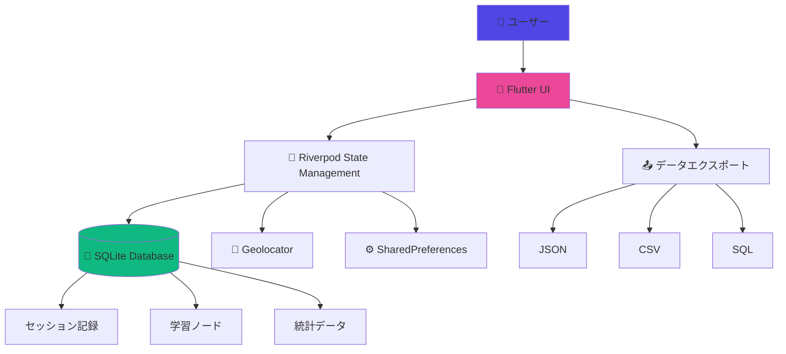

------

## 技術スタック

```mermaid
graph LR
    subgraph "Frontend"
        Flutter[Flutter 3.38]
        Riverpod[Riverpod v3]
        Material[Material Design 3]
    end
    
    subgraph "State & Logic"
        StateProvider[State Providers]
        AsyncProvider[Async Providers]
        FutureProvider[Future Providers]
    end
    
    subgraph "Data Layer"
        SQLite[sqflite]
        Prefs[shared_preferences]
    end
    
    subgraph "Features"
        Geolocation[geolocator]
        Charts[fl_chart]
        Calendar[table_calendar]
        Animation[flutter_animate]
    end
    
    Flutter --> Riverpod
    Riverpod --> StateProvider
    Riverpod --> AsyncProvider
    StateProvider --> SQLite
    StateProvider --> Prefs
    
    style Flutter fill:#02569B
    style Riverpod fill:#00D9FF
    style SQLite fill:#003B57
```

------

## データフロー

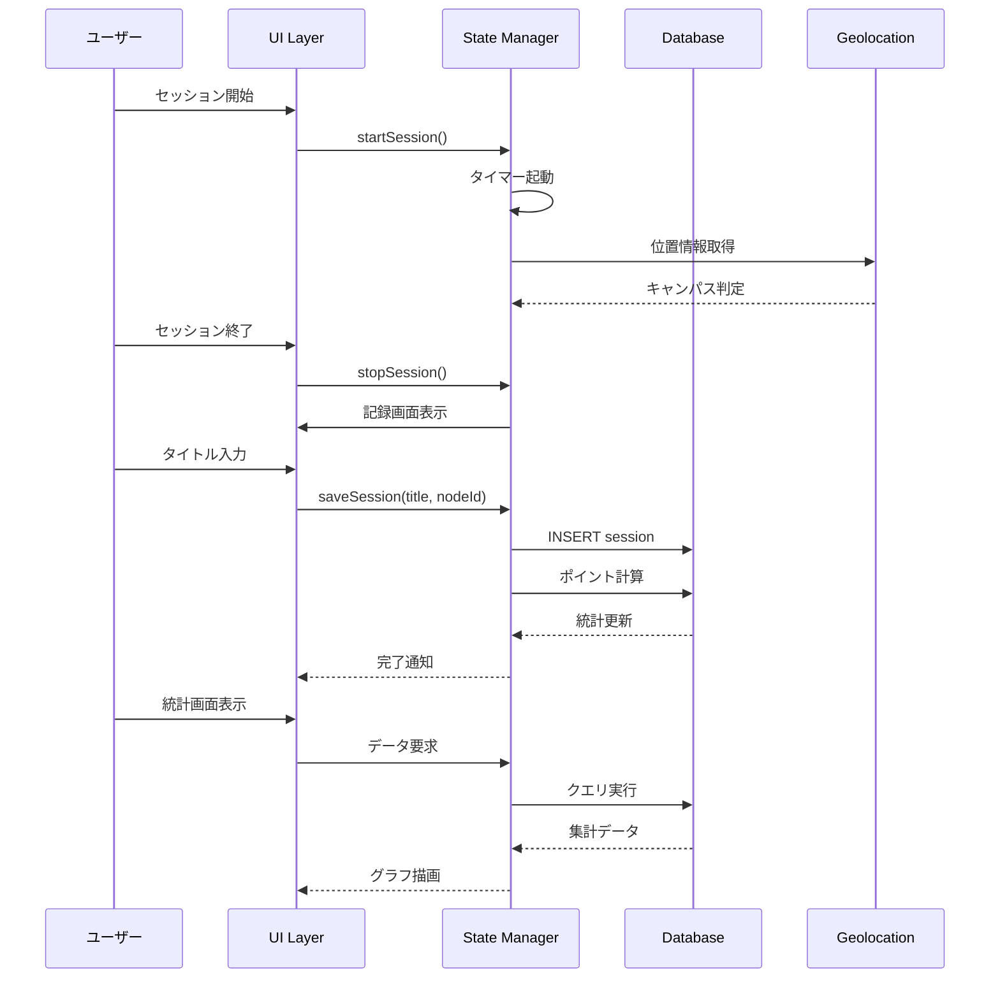

------

## 機能アーキテクチャ

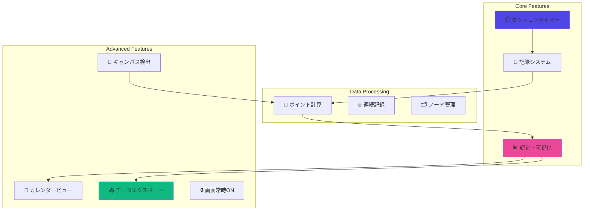

------

## データベーススキーマ

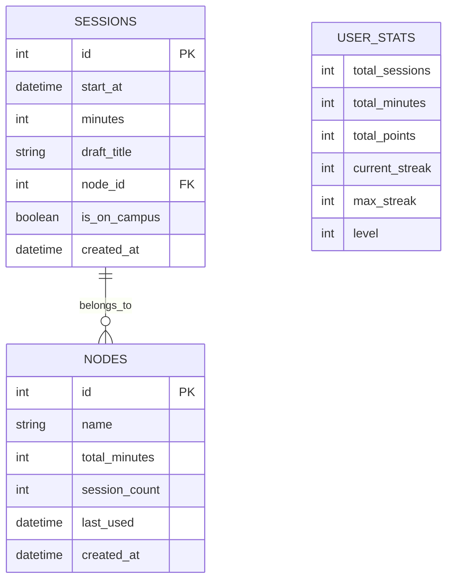

------

## 状態管理パターン

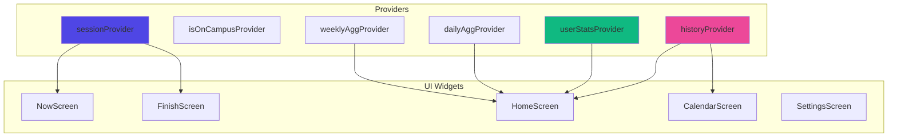

------

## 今後の進化

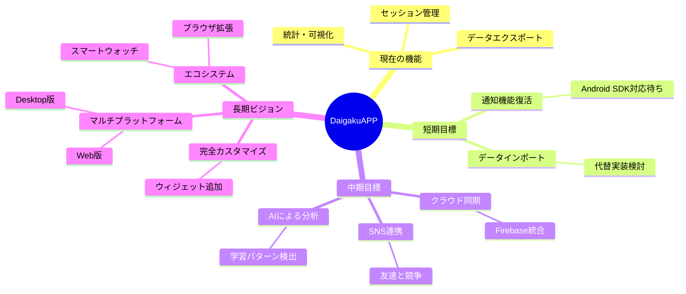

------

## アプリケーションライフサイクル

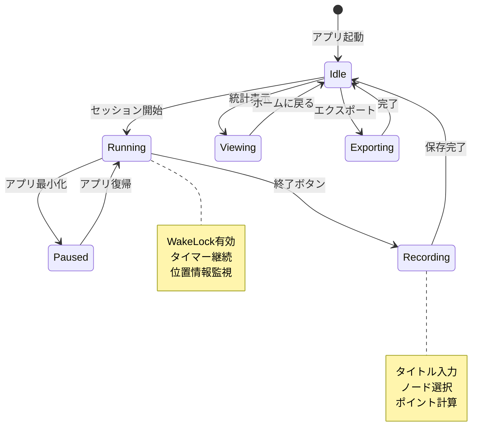

------

## パフォーマンス最適化

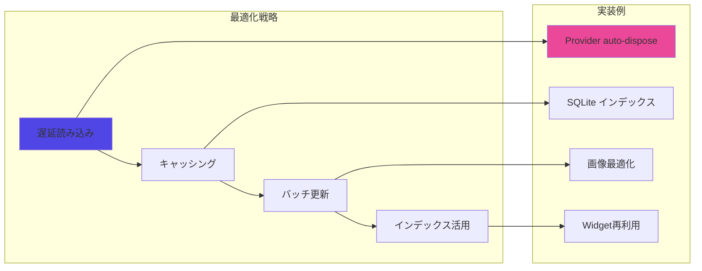

------

## セキュリティとプライバシー

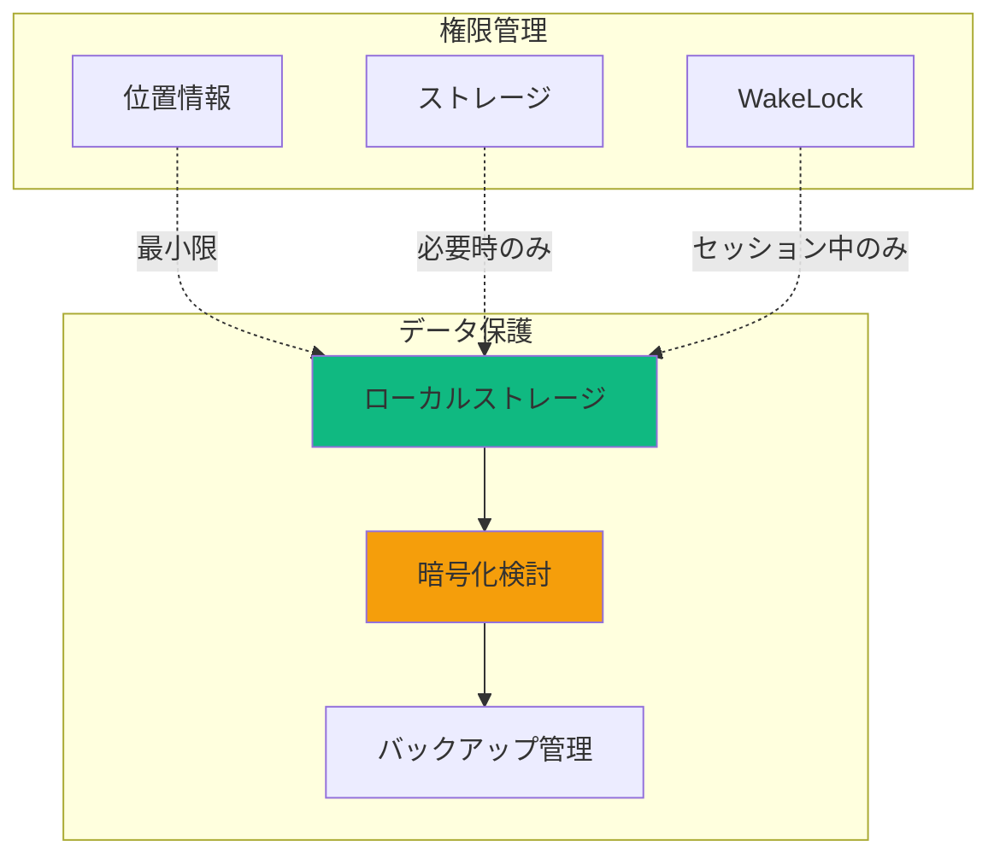

------

## 開発ロードマップ

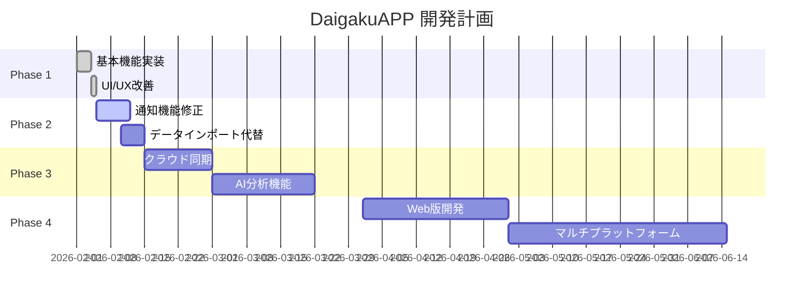

------

## まとめ

**DaigakuAPP** は、日々の自己管理を支える個人専用のプラットフォームです。

### 核となる哲学
- 📊 **データ駆動**: すべての行動を記録し、可視化
- 🎯 **シンプル**: 複雑な設定なしで即座に使える
- 🚀 **継続的進化**: 毎日使いながら改善を重ねる
- 💎 **完全所有**: あなたのデータはあなたのもの

### 現在地
- ✅ 基本機能完成
- ✅ 実機動作確認済み
- ⏳ Android SDK互換性課題対応中

### 未来へ
あなただけの最高の自己管理アプリを、一緒に作り続けましょう。
