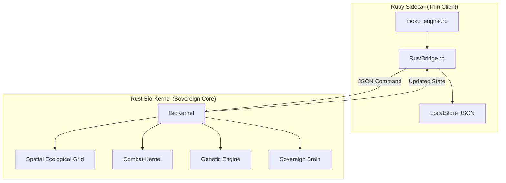
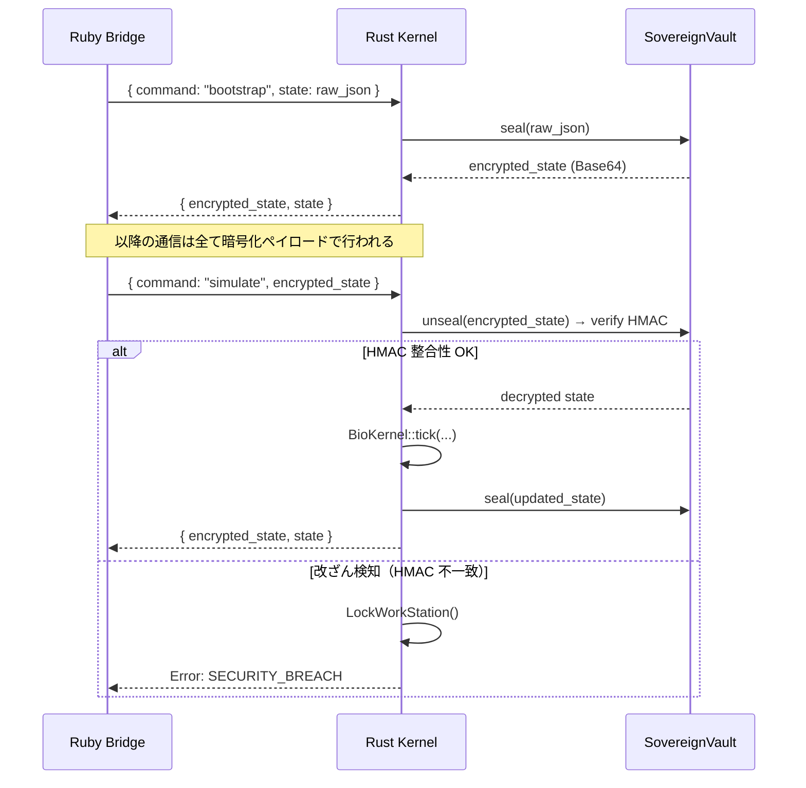

# DaigakuOS v2.0: Sovereignty Edition — Walkthrough

> 本ドキュメントは Phase 74〜78 の実装成果をまとめたウォークスルーです。

---

## フェーズ一覧

| Phase | 名称 | 概要 |
|-------|------|------|
| 74 | Total Core Migration | 全シミュレーションロジックを Rust へ移植 |
| 75 | Enforcement Sentinel | プロキシ・チューター実装 |
| 76 | Sovereign Warden | Win32 ハードネイティブ執行 |
| 77 | Vault of Sovereign Vitals | AES-256-GCM 暗号化セキュリティ |
| 78 | Sovereignty Launchpad | README 刷新 & 実行環境整備 |

---

## Phase 74 — Total Core Migration（Rust 主権）

Ruby ベースのプロトタイプから、高性能ネイティブ Bio-Kernel へ完全移行。

### 実装ファイル
- `rust_core/src/ecology.rs` — 64x64 空間拡散グリッド（酸素・毒素・腐敗）
- `rust_core/src/combat.rs` — 決定論的ダメージ解決カーネル
- `rust_core/src/genetics.rs` — DNA メチル化・エピジェネティック継承
- `rust_core/src/lib.rs` — `BioKernel::tick` 中央シミュレーションループ

### アーキテクチャ



---

## Phase 75 — Enforcement Sentinel（プロキシ & チューター）

ユーザー行動を Rust カーネルで監視・診断する仕組みを構築。

### 実装ファイル
- `rust_core/src/proxy.rs` — `GetForegroundWindow` / `GetWindowThreadProcessId` によるアクティブウィンドウ監視
- `rust_core/src/tutor.rs` — 生体ストレスと行動カテゴリの相関診断

### 執行指令レベル

| Level | 内容 |
|-------|------|
| 0 | 安定（介入なし）|
| 1 | 通知（代謝不全など）|
| 2 | 指示（鎮静化推奨）|
| 3 | 強制執行（LockWorkStation）|

---

## Phase 76 — Sovereign Warden（ハードネイティブ執行）

ウィンドウタイトル判定を廃止し、PID ベースの深層プロセス検査を実装。

### 変更点
- **Before**: `GetWindowTextW` によるタイトル文字列マッチング
- **After**: `OpenProcess + GetModuleFileNameExW` による実行バイナリパス検証

```rust
// proxy.rs 抜粋
let handle = OpenProcess(PROCESS_QUERY_INFORMATION | PROCESS_VM_READ, 0, pid);
let length = GetModuleFileNameExW(handle, 0, buffer.as_mut_ptr(), 512);
let path = String::from_utf16_lossy(&buffer[..length as usize]);
Self::categorize_path(&path)
```

**効果**: タイトル偽装による回避を不可能にしもこ。

---

## Phase 77 — Vault of Sovereign Vitals（暗号化要塞）

シミュレーション状態を AES-256-GCM で暗号化し、改ざん検知を実装。

### 実装ファイル
- `rust_core/src/security.rs` — `SovereignVault` (seal/unseal)

### セキュリティフロー



---

## Phase 78 — Sovereignty Launchpad（起動台）

プロジェクトを「即座に動く」状態に整備。

### 追加ファイル
- `bin/setup.rb` — Rust ビルド + Vault ブートストラップの全自動実行
- `bin/run.rb` — エンジン起動エントリポイント

### セットアップ手順

```powershell
# 1. Rust コアをビルドし、初期状態を暗号化封入する
ruby bin/setup.rb

# 2. Native Engine を起動
ruby bin/run.rb

# 3. 動作確認（テストスイート）
ruby test_bio_engine.rb
```

---

## 現在のファイル構成

```text
daigakuos-v2/
├── bin/
│   ├── setup.rb           # 全自動セットアップスクリプト
│   └── run.rb             # エンジン起動エントリポイント
├── rust_core/
│   ├── Cargo.toml         # 依存関係 (aes-gcm, hmac, sha2, windows-sys...)
│   └── src/
│       ├── lib.rs          # BioKernel (メインループ)
│       ├── state.rs        # BioState スキーマ
│       ├── ecology.rs      # 空間グリッド拡散
│       ├── combat.rs       # 戦闘カーネル
│       ├── genetics.rs     # 遺伝エンジン
│       ├── physics.rs      # 物理計算
│       ├── proxy.rs        # Win32 プロセス監視
│       ├── tutor.rs        # 行動診断チューター
│       ├── security.rs     # AES-GCM 暗号化 Vault
│       └── main.rs         # JSON-RPC コマンドディスパッチャー
├── ruby_native/
│   ├── core/
│   │   └── rust_bridge.rb  # 暗号化ペイロードブリッジ
│   └── moko_engine.rb      # メインエンジンループ
├── test_bio_engine.rb       # 主権対応テストスイート
└── README.md               # Sovereignty Edition ドキュメント
```

---

*Version: 2.0.0 (Sovereignty Edition)*
*Core Engineer: furukawa*
*Last Updated: 2026-04-20*
